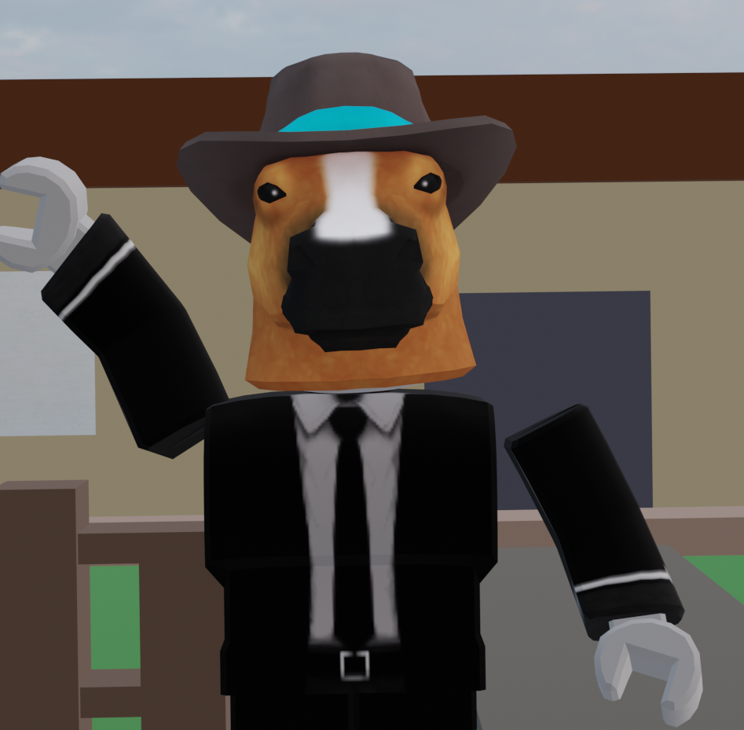
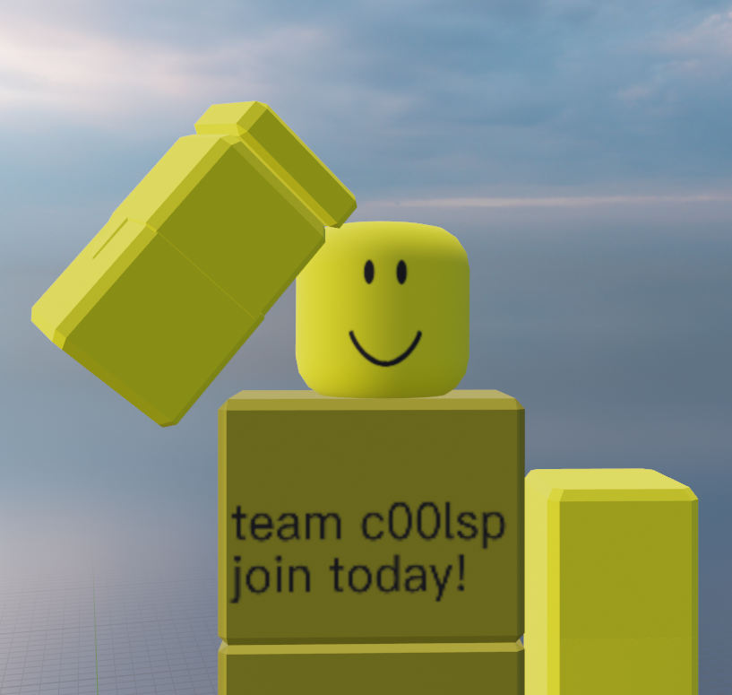
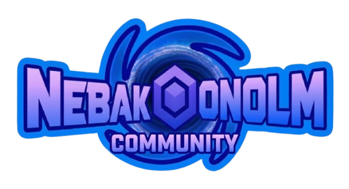
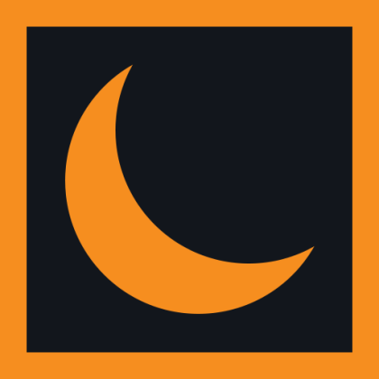

# 🚀 NEBAKIONOLM RESMİ GITHUB HAKKINDA SAYFASINA HOŞGELDİNİZ!
---

## 👥 Biz Kimiz? Profesyonel Tasarım ve İçerik Ekibi

GitHub sayfamıza hoş geldiniz! Biz, Roblox evrenini hem görsel hem de kurgusal anlamda en üst seviyeye taşımayı hedefleyen iki yakın arkadaş ve içerik üreticisiyiz. Kanallarımızda sadece oyun oynamıyor, aynı zamanda tamamen kendi üretimimiz olan dijital sanat eserlerini ve animasyonları sergiliyoruz.

---

### 🎮 Nebakionolm (Roblox İçerik Üreticisi & Profesyonel 3D Animatör)

YouTube macerama ilk olarak **Brawl Stars** videolarıyla adımı yazdırarak başladım. Zaman geçtikçe içimdeki yaratıcı enerjiyi tamamen **Roblox** dünyasına ve 3D tasarıma yönlendirme kararı aldım. Kanalımda, Roblox'un en eğlenceli, en gizemli ve ilgi çekici oyunlarını oynayarak sizlere hem eğlence hem de bilgi sunmaya çalışıyorum.

Aynı zamanda ileri seviye bir **3D Animatörüm**! Videolarımda, shorts içeriklerimde ve projelerimde gördüğünüz tüm karakter modellemelerini, rigging (iskelet giydirme) işlemlerini, çevre tasarımlarını ve özel sinematik sahneleri tamamen **Blender** kullanarak sıfırdan kendim tasarlıyorum. 3D dünyasının büyüleyici ve sonsuz detaylarını Roblox evreninin esnekliğiyle birleştirerek izleyicilerime görsel bir şölen sunuyorum.

Amacım; videolarımı izlerken keyif almanız, yeni şeyler öğrenmeniz ve her yeni video geldiğinde heyecanla beklemeniz. Eğer bu hissi sizlere geçirebiliyorsam, işte o zaman amacımın tam anlamıyla gerçekleştiğini biliyorum.

 

---

### 🎬 Dark (En İyi Arkadaş, 2D Animatör & Profesyonel Editör)

Ekibin diğer yarısı, en yakın arkadaşım ve prodüksiyon ortağım **Dark**! O da tam bir Roblox tutkunu olmasının yanı sıra, platform için harika **2D Roblox animasyonları** üreten çok yetenekli bir sanatçıdır. 

Dark, özellikle **video editleme ve kurgu konusunda tam bir uzmandır**. Videolarımızın akıcılığı, komik ve dikkat çekici efektlerin zamanlaması, ses senkronizasyonu ve izleyiciyi ekrana kilitleyen montaj tekniklerinin arkasındaki deha bizzat kendisidir. Kendine has tarzı ve eğlenceli kurgularıyla Roblox evrenine bambaşka, dinamik bir bakış açısı kazandırıyor.

Kanalda yayınladığımız tüm Roblox videoları ikimizin de ortak emeğiyle ve aynı özenle hazırlanıyor. Eğer kaçırdığınız videolar varsa gönül rahatlığıyla geri dönüp izleyebilirsiniz. Her bir içerik, sizlere kaliteli zaman geçirtebilmek ve komik videolar ile sizi eğlendirmek için özel olarak tasarlandı. Umarım el ele vererek çok daha geniş bir kitleye sahip olabiliriz!

 

---

## 🗺️ Detaylı Gelişim ve Ortak Yol Haritası (Roadmap)

Ekibimizin geçmişten geleceğe tüm planlarını, hedeflerini ve ulaştığı büyük kilometre taşlarını buradan adım adım takip edebilirsin:

#### 📌 Aşama 1: Kuruluş, Markalaşma ve Temeller (Tamamlandı)
- [x] YouTube kanallarının açılması ve kurumsal görsel kimliklerin oluşturulması
- [x] İlk Brawl Stars ve Roblox deneme videolarının kurgulanıp yüklenmesi
- [x] Profil resimleri, kanal banner tasarımları ve grafik şablonlarının optimize edilmesi

#### 📌 Aşama 2: Animasyon, Uzmanlık ve Ortaklık Çağı (Devam Ediyor)
- [x] Roblox evrenine tam zamanlı ve profesyonel geçiş yapılması
- [x] Blender ile özel 3D animasyon (Nebakionolm) ve 2D animasyon (Dark) süreçlerinin entegre edilmesi
- [x] İleri düzey video editleme teknikleriyle (Dark) video kalitesinin maksimuma çıkarılması
- [x] Discord topluluk sunucusunun ve Roblox Resmi Grubu'nun kurulması
- [ ] Düzenli haftalık ortak video yükleme ve Shorts takvimine geçiş yapılması

#### 📌 Aşama 3: Zirve Topluluk ve Büyük Projeler (Gelecek Planı)
- [ ] 10.000 Abone hedeflerine ulaşılması ve kanallara özel kutlama içerikleri
- [ ] Takipçilerimizle birlikte oynayacağımız, tamamen kendi sunucularımızda devasa canlı yayın etkinlikleri
- [ ] Nebakionolm & Dark ortaklığıyla ödüllü ve çekilişli Roblox turnuvaları düzenlenmesi
- [x] Tamamen kendi ürettiğimiz 3D ve 2D animasyon karakterleriyle özel mini dizi/kısa film serileri

---

## 🛠️ Kullandığımız Profesyonel Programlar & Sistem Altyapısı

Animasyon render süreçlerinde, ileri seviye video editlemelerinde ve Roblox oyunlarında en yüksek performansı yakalamak için kullandığımız profesyonel yazılım araçları:

| Yazılım / Program | Kullanım Amacı | Uzman Kullanıcı | Önem Derecesi |
| :--- | :--- | :--- | :--- |
| **Blender 3D** | Karakter Modelleme, İskelet Tasarımı (Rigging), Sinematik Render | Nebakionolm | 🔴 Kritik Seviye |
| **2D Animasyon Araçları** | 2D Görsel Tasarımlar, Katmanlı Animasyonlar ve Çizimler | Dark | 🔴 Kritik Seviye |
| **Profesyonel Editör Seti** | İleri Seviye Video Kurgu, Komik Efektler, Renk Ayarı (Color Grade) | Dark | 🔴 Kritik Seviye |
| **Roblox İstemcisi** | Ana İçerik Üretimi, Harita İncelemeleri ve Oynanış Sahneleri | Her İkisi | 🔴 Kritik Seviye |
| **OBS Studio** | Akıcı 60 FPS Bitrate Kayıpsız Video ve Oyun Kaydı | Her İkisi | 🟠 Yüksek Seviye |
| **CapCut & Premiere Pro** | Hızlı Kurgu, Ses Yönetimi, Altyazı ve Dinamik Kesimler | Her İkisi | 🟠 Yüksek Seviye |
| **Discord & Krisp** | Arka Plan Ses Temizleme, Ekip İçi İletişim ve Topluluk Yönetimi | Her İkisi | 🟡 Orta Seviye |

---

## 🔗 Tüm Sosyal Medya ve Topluluk Bağlantıları

Aşağıdaki bağlantı tablosunu kullanarak resmi hesaplarımıza tek tıkla erişebilirsin. İkimizin de buradaki bağlantıları dışında hiçbir sahte hesaba güvenmeyin!

| 🌐 Platform | 🚀 Doğrudan Bağlantı Köprü | 📌 Detaylı Açıklama |
| :--- | :--- | :--- |
| **📺 YouTube (Nebakionolm)** | [Abone Ol & Bildirimleri Aç](https://www.youtube.com/@Nebakionolm_shorts) | Komik ve 3D animasyonlu videoları kaçırmamak için tıkla! |
| **📺 YouTube (Dark)** | [Dark'ın Kanalına Abone Ol](https://www.youtube.com/@DrexelxMC) | Dark'ın hazırladığı harika 2D animasyonları ve profesyonel editleri takip et! |
| **🎮 Roblox Profilim** | [Roblox Üzerinden Takip Et](https://www.roblox.com/tr/users/5132186923/profile) | Profilimi incele, oyun içi kombinlerime bak ve beni arkadaş olarak ekle! |
| **🎮 Dark Roblox Profili** | [Dark'ı Roblox'ta Takip Et](https://www.roblox.com/tr/users/2758994891/profile) | Dark'ın profilini incele ve Roblox platformu üzerinden takibe al! |
| **👥 Roblox Grubum** | [Nebakionolm Topluluğu'na Katıl](https://www.roblox.com/tr/communities/144777197/Nebakionolm-Toplulu-u) | Gruptaki duvar yazışmalarına katıl, özel etkinlikleri kaçırma! |
| **📸 Instagram** | [Instagram'dan Takip Et](https://www.instagram.com/ytnebakionolm/) | Günlük hayatımdan özel kareler, kamera arkası görüntüleri ve duyurular. |
| **💬 Discord Sunucum** | [Discord Sunucumuza Katıl](https://discord.com/invite/pRx3GPCYhN) | Sesli odalarda bizimle sohbet etme ve videolara çıkma fırsatı yakala! |
| **🛡️ Guilded Sunucum** | [Guilded Sunucumuza Katıl](https://www.guilded.gg/r/cmE9MdkZzE?i=myyY0lJm) | Roblox oyuncuları için özel olarak geliştirilmiş alternatif topluluk alanımız. |

---

## ❓ Sıkça Sorulan Sorular (S.S.S.)

Aşağıdaki panelleri genişleterek aklınıza takılan soruların profesyonel yanıtlarına ulaşabilirsiniz:

💬 Soru 1: Videoların hazırlık süreci nasıl işliyor?

 

Her video, fikir aşamasından yayına girene kadar titizlikle planlanır. Nebakionolm oynanış sahnelerini kaydeder ve gerekli 3D animasyonları Blender'da hazırlarken, Dark tüm görüntüleri profesyonel kurgu teknikleriyle bir araya getirir. Ortalama bir video 2-4 günlük emek içerir.

---

## 🎨 Topluluk Fan Animasyon Köşesi

  
    
  <b>Topluluğumuzun Yaratıcı Animasyon Alanına Hoş Geldiniz!</b>

Karakterlerimizi kullanarak kendi fan animasyonunu yapmak ister misin? Repomuzda bulunan **Modeller klasörünün zip halini** indirip içindeki dosyaları dilediğin gibi kullanabilirsin.

---

### ⬇️ Dosyaları İndir

  

---

### 🛠️ Bu Dosyaları Ne İçin Kullanabilirim?

🎬 Tıkla ve Öğren: Hangi Araçlarla Kullanabilirsin?

 

Zip dosyasından çıkaracağın karakter modellerini aşağıdaki araçlarla kullanabilirsin:

| | Araç | Açıklama |
| :---: | :--- | :--- |
|  | **Moon Animator** | Roblox Studio için geliştirilmiş profesyonel animasyon eklentisidir. Dosyaları Roblox Studio'ya aktararak Moon Animator ile sahne sahne animasyon yapabilirsin. Keyframe sistemi, kamera animasyonları ve efekt desteğiyle sinematik kalitede içerikler üretebilirsin. |
| 🎨 | **2D Araçlar** | Karakter görsellerini referans alarak kendi tarzında 2D animasyon yapabilirsin. Dark'ın kullandığı 2D araçlarla içerik üretmek tamamen serbest! |

> ⚠️ **Kullanım Kuralları:** Fan animasyonlarında karakterlerimizi kullanabilirsin, ancak lütfen içeriğin altına **kaynak belirt** (Nebakionolm & Dark) ve **ticari amaçla kullanma**. Yaptığın animasyonu Discord sunucumuzda bizimle paylaşmayı unutma! 🎉

---
